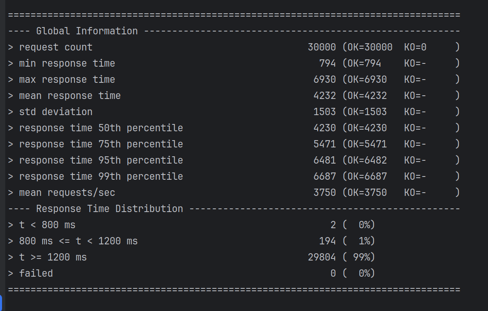
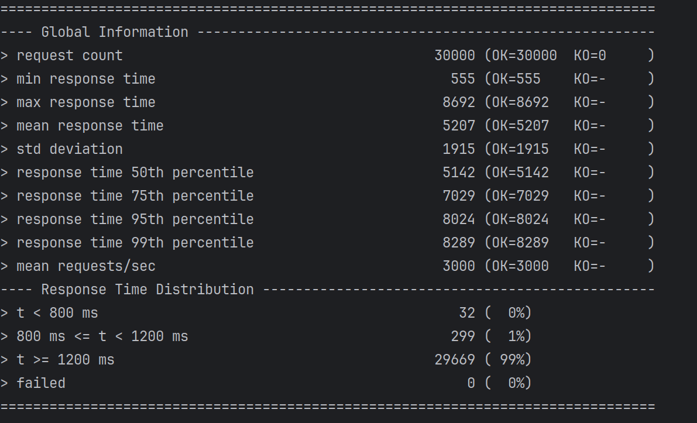

# Micro WebPoS 

请参考spring-petclinic-rest/spring-petclinic-microserivces 将webpos项目改为微服务架构，具体要求包括：
1. 至少包含独立的产品管理服务、订单管理服务以及discovery/gateway等微服务架构下需要的基础设施服务；
2. 请将系统内的不同微服务实现不同的计算复杂度，通过压力测试实验验证对单个微服务进行水平扩展（而无需整个系统所有服务都进行水平扩展）可以提升系统性能，请给出实验报告；
3. 请使用`RestTemplate`进行服务间访问，验证Client-side LB可行；
4. 请注意使用断路器等机制；
5. 如有兴趣可在kubernetes或者minikube上进行部署。

请编写readme对自己的系统和实验进行详细介绍。

# 实验：
# SQL瓶颈的服务实验
1个商品管理服务：
平均时间4232ms

2个商品管理服务：
平均时间5142ms

这个结果在意料之中，因为这些服务的主要瓶颈在于数据库查询，因此增加服务不会提高处理速度。

# cpu密集型服务实验
我本想对pos-counter这种涉及计算的服务进行实验，但是实际上checkout服务也设计查询、更新库存的sql行为，因此为了证明微服务水平扩展能有效提升性能，我在实验中删去了这些行为，并且人为的增加了计算复杂度。
1个counter服务：
平均时间16156ms

2个counter服务：
平均时间10118ms

由于服务依然设计查询，并且负载均衡有开销，因此时间花费不是严格的二倍

# 微服务间访问
我对pos-counter使用了微服务间的访问，因为checkout服务需要查询carts内容，并且更新Products库存，所以该服务是依赖于前两个服务的。

# 断路器
我在products中尝试了断路器，如果没有查到对应id的商品，则会输出一个默认的商品。

# 系统演示
